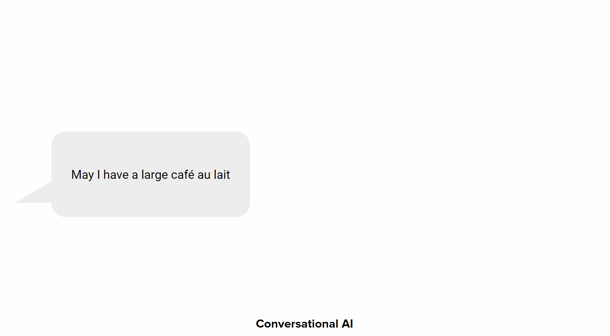

## What is Conversational AI?

Conversational AI is the set of technologies that come together to allow a human to have a conversation with a machine, typically through chat bots or virtual assistants.  Conversational AI implementations can be found across different industries helping with a variety of simple to complex tasks.  To help illustrate what exactly Conversational AI is and the different components, we will use the example of placing a coffee order.

At a high level, the natural language the user says is translated to an intent and entity values are extracted.  The assistant application uses this information then determine if more information is required from the user or if we have everything we need to complete the order.

## Technologies

The primary technologies include:

- **Speech to Text (STT)** The most basic speech to text engines take audio and automatically transcribe the speech while more advanced can identify different speakers, determine tone, and can handle lower fidelity audio (like in the case of telephony).

- **Natural Language Understanding (NLU)** The NLU is what turns the text of a user's query into generalized requests, ofter referred to as intents. It operates off of an interaction model that defines sample utterances for an intent and any optional slots, or variables, that contains information to be extracted from the sample utterances.

- **Dialog Manager** The dialog manager is a system that takes an input, the intent from the NLU, follows a set of instructions for the provided intent and other contextual information, and then provides an output. Common features include slot filling, error/input unknown handling, session and long term state, and topic tracking.

- **Natural Language Generation (NLG)** Within the field of natural language processing (NLP), NLG is one of the most challenging. The most common form is defining rule based systems for taking a set of structured data and converting it to natural language. It is possible to generate natural language based on machine learning models as well but practical applicability within an virtual assistant is still limited.

- **Text to Speech (TTS)** Text to speech is required for voice channels that virtual assistants can communicate on. Beyond just turning text into speech, distributed through an audio file format, more advanced features include support for speech synthesis markup language (SSML) and lexicons (think global pronunciation guides).

## What is the Optimal Conversation Studio?

The Optimal Conversation Studio, or OC Studio, is a conversational AI middleware platform for building intelligent virtual assistants. It is a flexible platform that allows you to bring your own conversational AI technologies and brings them all together to allow you to easily build and maintain intelligent virtual assistants (IVA).

OC Studio brings together the content, model, and dialog management together in one application that work together so you can then push your IVA out to different channels such as telephony, smart speaker and chat and continually improve it.

## Use cases for Conversational AI

The most common manifestation of conversational AI is in an intelligent virtual assistant (IVA). These IVAs can be informational in nature to help with customer support, can help with repetitive tasks like order taking or information gathering, or a combination of the two. Throughout this guide, we will use an example of a virtual barista that can help take coffee orders and is knowledgeable about the products.
